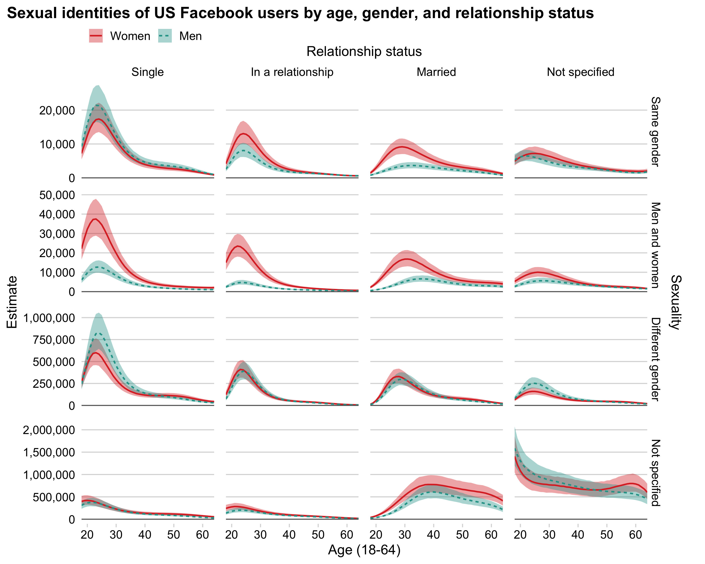

# Digital Traces of Sexualities

Code and materials for "Digital Traces of Sexualities: Understanding the Salience of Sexual Identity through Disclosure on Social Media." Code is MIT licensed; open-access article is CC BY-NC.

Citation: 

> [to be added]



Note: this repository includes only the code relevant to the published paper, not all of the code produced over the course of the project. It includes **Python scripts** for data collection and **R scripts** for data analysis.

## Data collection

- `get_interested_in_and_relationship_status_by_age.py` is the main data collection script
- `utils.py` contains helper functions
- `convert_json_to_csv.py` turns the JSON output from the data collection script into a csv file for analysis

The Python data collection script was run with a `config.yml` file (ignored in `.gitignore`), set up like this:

```{.yml}
app_id: *****
app_secret: *****
access_token: *****
ad_account_id: *****
```

This is the authentication information for the facebookads Python package. 

We collected data in 2017 using version 2.11 of the [Marketing API Python SDK](https://developers.facebook.com/docs/marketing-api/sdks/) (on a Raspberry Pi; the code is lightweight to run), and **it is unlikely that the code will work with more recent versions**. We include this code for transparency, not reproducibility.

## Data analysis

- `R/data_processing/relationship_data.R` recodes data, calculates proportions, and filters to the appropriate subset for analysis
- `R/models/fit_bayesian_model.R` fits the main model in the paper using rstanarm and writes it to an intermediate .rds file
- `R/models/plot_bayesian_model.R` creates and saves 7 figures for the paper using tidybayes and ggplot2
- `R/models/model_comparison_appendix.R` fits alternative models and creates a table comparing model fits
- `R/tables/descriptive_appendix.R` creates a table of descriptive statistics

The analysis code is reproducible starting from the csv output from data collection. We have not included the data file in this public repository. Sexual identity is potentially sensitive information; while we believe risks from releasing aggregate data are low, we cannot be certain that those risks are nonexistent. We've chosen to err on the side of caution for now.

Figures are saved to `output/figures/models`.

## Authors

- Connor Gilroy
- Ridhi Kashyap

Contact Connor with any questions ([@ccgilroy](https://twitter.com/ccgilroy), or cgilroy at uw for email).
